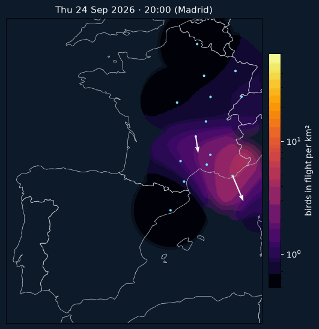
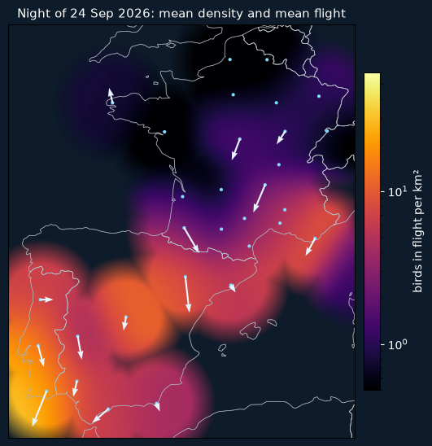

# Datos de radar de migración con horas de retraso, no días

*Propuesta de colaboración para SEO/BirdLife y AEMET · octubre 2026 · [English version](proposal_en.md)*

La migración nocturna sobre la península ya se puede reconstruir y predecir con radares meteorológicos. Lo que falta es
recibir los datos a tiempo para que sirvan esa misma noche.

## El problema

Los perfiles verticales de aves (VPTS) de los radares españoles, portugueses y franceses se publican en abierto a través
de Aloft, pero llegan con unas 48–72 horas de retraso. Para avisar a un parque eólico, a un aeropuerto o a un programa de
apagado de luces, el dato tiene que estar disponible en pocas horas. Hoy en España no hay ningún producto público que lo
haga.

## Lo que ya funciona

`sub-nocte` es un proyecto abierto que combina los perfiles de radar con meteorología para predecir la intensidad de
migración de cada noche, también en lugares sin radar. En una validación que deja fuera radares completos obtiene un AUC
de 0,77 y recoge el 34 % de las noches intensas, frente al 10 % que se esperaría por azar.

Sobre esa predicción hemos construido una herramienta de decisión para 151 zonas eólicas de la península y Baleares. En
el análisis retrospectivo de 59 zonas (temporadas 2021–2026), parando solo en las noches más intensas y con viento flojo:

| Noches de parada por temporada y zona | Energía nocturna perdida | Migración prevista en esas noches |
|---:|---:|---:|
| 7 | 2 % | 11 % |

Las noches de más paso suelen ser de viento flojo (correlación −0,19 entre potencia y densidad de aves), y por eso parar
cuesta poco.

*Recreación de la noche del 24/09/2026 a partir de 38 radares de España, Portugal y Francia, en pasos de 20 minutos. El
color es la densidad de aves y las flechas, la dirección y velocidad media de vuelo. Las zonas lejanas a un radar se
desvanecen porque no hay dato.*

*Media de la noche. Con datos casi en tiempo real, este mapa estaría listo a primera hora de la mañana siguiente y su
versión prevista, la tarde anterior.*

## Lo que pedimos

- **A AEMET:** acceso a los volúmenes de reflectividad y velocidad radial de su red, o a los perfiles ya calculados, con
  menos de 6 horas de retraso y en el formato ODIM que ya envía a OPERA. Basta con la franja nocturna de abril a junio y
  de agosto a noviembre.
- **A SEO/BirdLife:** que respalde la solicitud y nos ayude a validar los mapas con sus datos de seguimiento (conteos en
  pasos migratorios, anillamiento), siempre en forma agregada y sin ubicaciones sensibles.

## Lo que ofrecemos

- Mapa diario de la noche anterior y previsión a 7 días, públicos y con código abierto.
- Recomendaciones por zona para parques eólicos, con su coste energético estimado.
- Verificación diaria de la predicción frente a lo que midieron los radares.
- Datos derivados con licencia abierta y crédito a AEMET y SEO/BirdLife.

## Precedente

El 13 de mayo de 2023 los Países Bajos frenaron por primera vez en el mundo parques eólicos marinos (Borssele y Egmond aan Zee) para dejar paso a aves migratorias: durante cuatro horas las turbinas giraron a dos vueltas por minuto como máximo. La decisión se tomó con dos días de antelación gracias a un modelo de la Universidad de Ámsterdam que combina meteorología y radares de aves. España tiene una red de radares comparable y mucha más migración terrestre. Solo falta que los datos lleguen a tiempo. Fuente: [offshoreWIND.biz, 17/05/2023](https://offshorewind.biz/2023/05/17/dutch-stop-offshore-wind-turbines-to-protect-migratory-birds-in-international-first).

---

**Pablo** · [Asensio94](https://github.com/Asensio94) · Proyecto para salvar a las aves

Código y metodología: [github.com/Asensio94/sub-nocte](https://github.com/Asensio94/sub-nocte). Datos: Aloft (CC0),
Open-Meteo, OpenStreetMap (ODbL).
